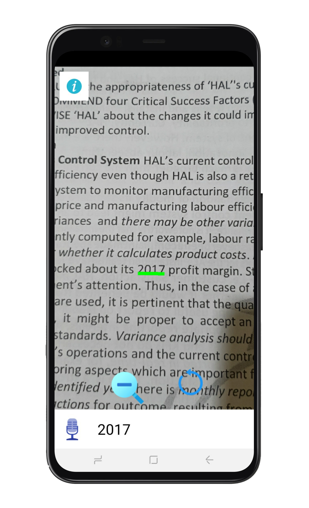

# [Alt Vision](https://altvision.vercel.app/)     
A smart magnifying glass!

You use Google search in digital world.
Now you can use ALtVision keyword search in the physical world.
Point your camera to documents, product labels, bank statements, or restaurant menus. Speak your keywords, the app will locate the areas of interest for you. Then you may zoom in to read details.
The app can tolerate typo in your keywords and errors in OCR results.

## Getting Started

it uses Firebase ML Toolkit.

It has a unique features like Voice Search, Detect the result.

    
    
    
    

